<h1 align="center">
 ✨ a better world starts with better software ✨
</h1>

<table>
 <tr>
  <td>about me ☝🏻🤓</td>
  <td>learning 📚</td>
 </tr>
 <tr>
  <td>
   Hello it's me Ari, I'm a 25 y/o software engineer focused at backend and desktop with interest on design patterns, clean architectures and learn new technologies.    
   right now:  
   <ul>
    <li>🎓 Pursuing a Master's in Software Engineering & DevOps</li>
    <li>☁️ Preparing for the AWS Solutions Architect certification</li>
   </ul>
  </td>
  <td>
   
   
   
  </td>
 </tr>
</table>

 

  

 

 

 ## ⌨️ Working on

 <table width="100%">
  <tr>
   <td>Me✨✨</td>
   <td>Kind</td>
   <td>Project</td>
   <td>Stack</td>
  </tr>
  <tr>
   <td rowspan="5" width="30%">
    
   </td>
   <td>🧃 Personal</td>
      <td>Vitalsuite - Medical ERP Suite</td>
      <td>
        
        
        
        
      </td>
  </tr>
  <tr>
     <td>🧃 Personal</td>
     <td>Kickstart - Project secrets generator</td>
     <td>
      
      
      
      
      
     </td>
  </tr>
  <tr>
   <td>🧃 Personal</td>
      <td>Spaniel - Internal Helpdesk</td>
      <td>
        
        
        
      </td>
  </tr>
      <td>🧃 Personal</td>
      <td>Sekai - Application Sandbox w/Impersonation</td>
      <td>
        
        
        
        
      </td>
  </tr>
  <tr>
    <td>🧃 Personal</td>
    <td>Vitalsuite AI Customer Support Agent</td>
    <td>
      
      
       
      
      
    </td>
  </tr>
 <table>

 

 

<h2>⚡ Technology Stack </h2>

<table width="100%">
    <tr>
      <th width="20%">Environment</th>
      <th width="80%">Technologies</th>
    </tr>
    <tr>
      <td>Languages</td>
      <td>
        
        
        
        
        
      </td>
    </tr>
    <tr>
      <td>Frontend</td>
      <td>
        
        
        
        
        
        
        
        
        
      </td>
    </tr>
    <tr>
      <td>Backend</td>
      <td>
        
        
        
        
        
        
        
      </td>
    </tr>
    <tr>
      <td>Desktop</td>
      <td>
        
        
        
      </td>
    </tr>
    <tr>
      <td>Database</td>
      <td>
        
        
        
        
        
        
      </td>
    </tr>
    <tr>
      <td>Extra</td>
      <td>
        
        
        
        
        
        
        
       
       
       
       
       
       
      </td>
    </tr> 
</table>

 

 

 

<h2>📊Github Stats</h2>

|  |  |
| --- | --- |
